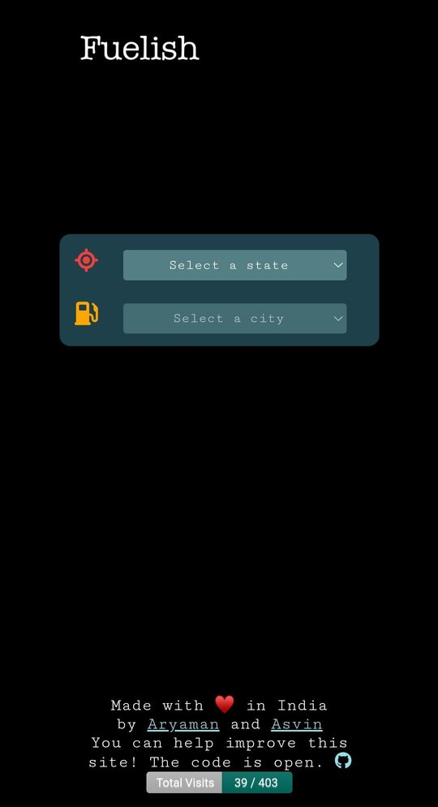
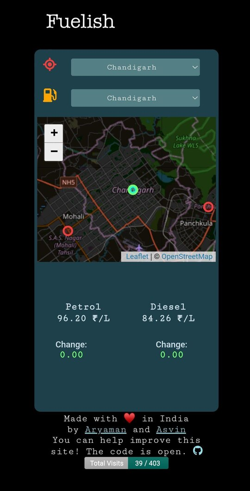
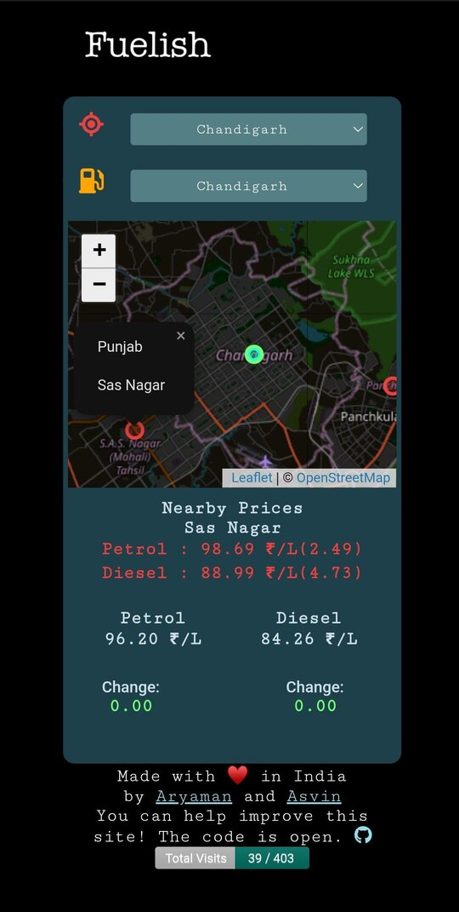

# Fuelish

Fuelish is a simple web application that helps you to check the fuel prices of your state. With Fuelish, you can easily compare the fuel prices of different states and save money on fuel expenses.

## Table of Contents

- [Fuelish](#fuelish)
  - [Table of Contents](#table-of-contents)
  - [Features](#features)
  - [Screenshots](#screenshots)
  - [Technologies Used](#technologies-used)
  - [Installation](#installation)
  - [Usage](#usage)
  - [Contributing](#contributing)
  - [Author](#author)
  - [License](#license)

## Features

- Displays the latest fuel prices of your state
- Displays the petrol and diesel price and the daily changes so you can avoid overpaying for gas.
- Finds out the lowest price within 50-kms radius.
- Directs you to the nearest petrol pump.
- Live Location! (Don't need to explain)
## Screenshots

## Technologies Used

Fuelish is built with the following technologies:

- HTML, because it's the foundation of the web.
- CSS, because we don't want our app to look like it's from the 90s.
- JavaScript, because we want to make our app interactive.
- OpenMaps API, because we want to show you your location.
- Vercel for deployment.

## Installation

To install Fuelish, follow these steps:

1. Clone the repository: git clone https://github.com/Doofenshmirtz-Evil-Incorp/Fuelish
2. Navigate to the project directory: cd Fuelish
3. Open index.html in your web browser.

## Usage

To use Fuelish, follow these steps:

1. Enter your location in the search bar.
2. Fuelish will display the petrol and diesel prices of your location.

## Contributing

We welcome contributions from the community, especially if you're willing to bribe us with fuel. To contribute to Fuelish, follow these steps:

1. Fork the repository.
2. Create a new branch: git checkout -b my-feature-branch
3. Make your changes and commit them: git commit -am 'Add some feature'
4. Push to the branch: git push origin my-feature-branch
5. Submit a pull request, and we'll consider it (as long as it's not just a request to add a feature that tells jokes).

**Important**: Please do not ask for assignment before creating a pull request. We encourage you to directly create a pull request for your contributions.

## Author

Fuelish was created by [Aryaman Srivastava](https://github.com/actuallyaryaman) and [Asvin Jain](https://github.com/asvin1), two fuel-saving ninjas who believe that the only thing better than a full tank of gas is a full tank of gas that didn't break the bank. If you have any questions or feedback, you can reach out to us at  We promise to respond faster than a V8 engine revving up!

## License

Fuelish is licensed under the GNU V3 License. See the [LICENSE](LICENSE) file for details. This license ensures that if you become a millionaire because of the money you saved using Fuelish, you'll still have to give us credit for it.

##

